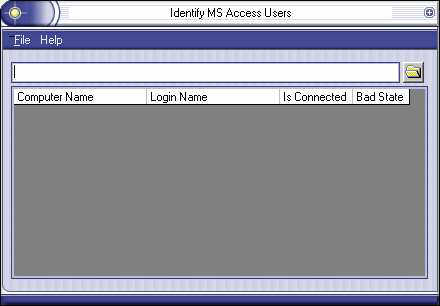

## Display Users

### Description

Display information on who's logged in to a Access Database (updated changing text so it doesn't say 'Save File' in dialog box)
 
### More Info
 

             |
---                |---
**Submitted On**   |2003-12-18 05:05:12
**By**             |[GettingOld](https://github.com/Planet-Source-Code/PSCIndex/blob/master/ByAuthor/gettingold.md)
**Level**          |Advanced
**User Rating**    |4.8 (24 globes from 5 users)
**Compatibility**  |VB 6\.0
**Category**       |[Complete Applications](https://github.com/Planet-Source-Code/PSCIndex/blob/master/ByCategory/complete-applications__1-27.md)
**World**          |[Visual Basic](https://github.com/Planet-Source-Code/PSCIndex/blob/master/ByWorld/visual-basic.md)
**Archive File**   |[Display\_Us16848412182003\.zip](https://github.com/Planet-Source-Code/gettingold-display-users__1-50502/archive/master.zip)

